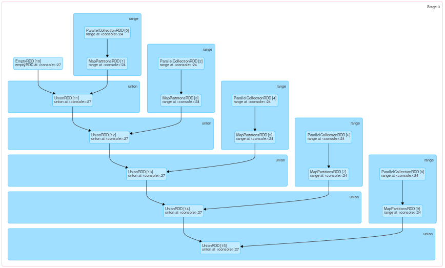

# Iterative Algorithms

One of the strong suits of the Apache Spark is that it provides elegant and concise ways to express iterative algorithms without adding significant computational overhead. It is important though, to understand what are the implications of iterative processing and how to monitor and manage its different aspects.

## Iterative Applications and Lineage

Distributed data structures in Spark can be perceived as recursive data structures where each RDD depends on some set of the parent RDDs. To quote [the source](https://github.com/apache/spark/blob/2.0.0-preview/core/src/main/scala/org/apache/spark/rdd/RDD.scala#L60-L67):

> Internally, each RDD is characterized by five main properties:
>
>  - A list of partitions
>  - A function for computing each split
>  - __A list of dependencies on other RDDs__
>  - Optionally, a Partitioner for key-value RDDs (e.g. to say that the RDD is hash-partitioned)
>  - Optionally, a list of preferred locations to compute each split on (e.g. block locations for
>    an HDFS file)

Since RDDs are immutable every transformation extends the lineage creating a deeper stack of dependencies. While it is not an issue in case of simple chaining, it can become a serious in iterative processing up to the point where evaluation may become impossible due to stack overflow. Spark provides two different methods to address this problem - checkpointing and flat transformations.

### Checkpointing

Checkpointing (don't be mistaken with [checkpointing in Spark Streaming](https://spark.apache.org/docs/latest/streaming-programming-guide.html#checkpointing)) is a mechanism which enables truncating the lineage. It has following consequences:

- It saves RDD to Spark checkpoint directory.
- It removes references to the partent RDDs.

`checkpoint` is lazy and unless given RDD is cached it will have to be reevaluated.

The biggest advantage of checkpointing is that it is universal. It can be used with any lineage independent of particular transformations.

### "Flat transformations"

As a complementary to truncating lineage we can use transformations which keep lineage short. This can be achieved either with built-in methods like `SparkContext.union` and `PairRDDFunctions.cogroup` or by preferring fat transformations over transformation chaining.

#### Creating union of multiple RDDs

Whenever we perform and iterative union without referencing partial results we can replace transformation chaining with a single call to `SparkContext.union`. Lets use DAG to illustrate the difference between these two methods. Let's assume that we have a sequence of RDDs:

```scala
val rdds = (0L to 4L).map(i => sc.range(10L * i, 10L * (i + 1L)))
```

If we chain `union` calls:

```scala
rdds.foldLeft(sc.emptyRDD[Long])((acc, rdd) => acc.union(rdd))

```

we'll get a following DAG:




In contrast with a single call to `SparkContext.union`:

```scala
sc.union(rdds)
```

we'll get a shallow DAG which looks as shown below:


#### Joining multiple RDDs

#### Pushing operations to the lower position in the stack


### Truncating Lineage in `Dataset` API

## Controling Number of Partitions in Iterative Applications

